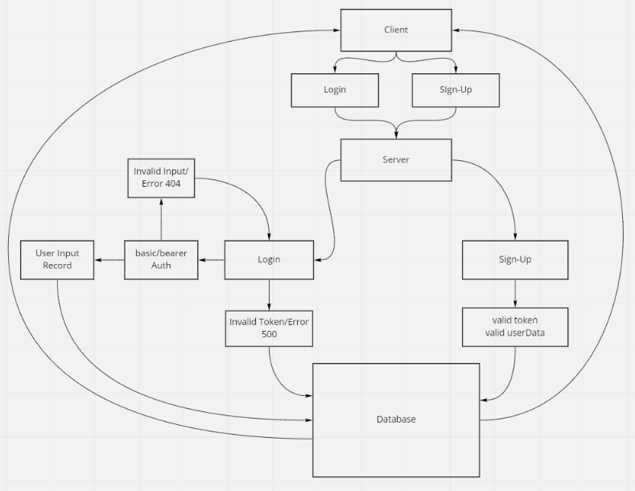

# bearer-auth
Created by Bryce Pfingston  

## Installation  
npm i { jest, express, dotenv, supertest, pg, sequelize, sqlite3, seqluelize-cli, bcrypt, base64, jsonwebtoken, cors, morgan }  
  
## Summary of Problem Domain  
Deploy an Express server that implements Basic Authentication, with signup and signin capabilities, using a Postgres database for storage.  

## Links to application deployment  
 
Heroku: https://bearer-auth-bryce.herokuapp.com/ 
Githut: https://github.com/bpfingston/bearer-auth
  
## Include embedded UML

## Talk about your routes

sign-in:
    - SignIn:
        - validate user
        - HTTP POST
    - SignUp:
        - Create a new Username and Password
        - HTTP POST
    - Secret
